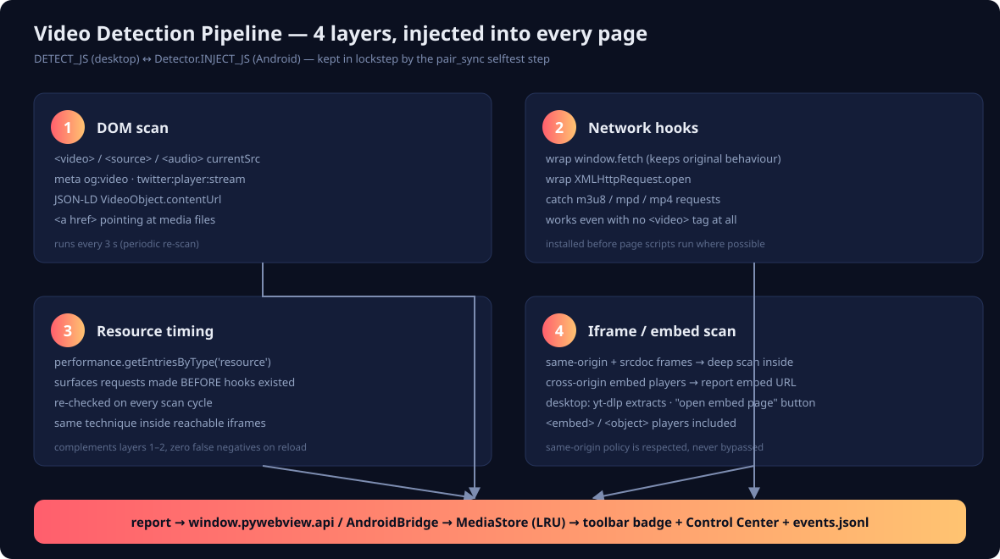

# VDO Grabber

[](https://github.com/NarDecH/VDO_Download_APK/actions/workflows/desktop.yml)
[](https://github.com/NarDecH/VDO_Download_APK/actions/workflows/android.yml)
[](https://github.com/NarDecH/VDO_Download_APK/releases/latest)

**เปิดหน้าเว็บที่คุณต้องการ → กดปุ่มดาวน์โหลดวิดีโอที่กำลังแสดงอยู่**

แอปนี้เกิดจากการวิเคราะห์ส่วนขยาย Chrome "Video Download Helper" (โฟลเดอร์ `code/`) แล้วออกแบบใหม่
เป็นแอปสแตนด์อโลน 2 แพลตฟอร์ม:

| แพลตฟอร์ม | รูปแบบ | เอนจิน |
|---|---|---|
| Windows | `VDOGrabber.exe` ไฟล์เดียว (PyInstaller) ไม่ต้องติดตั้ง Python | pywebview (WebView2) + yt-dlp + ffmpeg |
| Android | `VDOGrabber-android.apk` (GitHub Actions build) | Kotlin WebView + DownloadManager + yt-dlp (HLS/DASH ในตัว) |
| Chrome | ส่วนขยาย MV3 (`extension/`, zip ใน release) | content script + MAIN-world hooks + chrome.downloads |

### ฟีเจอร์แต่ละแพลตฟอร์ม

| ฟีเจอร์ | Windows | Android | Chrome |
|---|:-:|:-:|:-:|
| ตรวจจับวิดีโอ 4 ชั้น (DOM/hooks/timing/iframe) | ✅ | ✅ | ✅ |
| ไฟล์ตรง mp4/webm/mp3 | ✅ | ✅ | ✅ |
| HLS/DASH (m3u8/mpd) | ✅ yt-dlp+ffmpeg | ✅ yt-dlp ในตัว (v1.1+) | ✅ hook MSE |
| เลือกคุณภาพ/รูปแบบ | ✅ | — | — |
| blob:/MSE capture | ✅ ผ่าน yt-dlp | — | ✅ offscreen assembler |
| ดาวน์โหลดพร้อมกันหลายงาน + ยกเลิก | ✅ | ✅ (ต่อรายการ) | — |
| Log 3 ไฟล์ + Export diagnostics | ✅ | ✅ | popup logs |

## ตรวจจับวิดีโออย่างไร

ทุกหน้าที่เปิดจะถูกฉีดสคริปต์ตรวจจับ 4 ชั้น (ฝั่ง desktop และ Android เป็นโค้ดคู่กัน):



1. **DOM scan** — `<video>/<source>/<audio>`, meta og:video, JSON-LD VideoObject, ลิงก์ที่ชี้เข้าไฟล์สื่อ
2. **Network hooks** — wrap `fetch`/`XMLHttpRequest` (MAIN world) จับ m3u8/mpd/mp4 แม้ไม่มีแท็กวิดีโอ
3. **Resource timing** — จับ request ที่เกิดก่อน hook ถูกติดตั้ง
4. **Iframe scan** — same-origin/srcdoc สแกนลึกข้างใน · cross-origin embed player รายงาน URL embed (+ปุ่มเปิดหน้า embed)

> กติกาการดูแล: ตัวตรวจจับสองฝั่งเป็น "คู่" ต้อง sync กันเสมอ — `--selftest` ขั้น `pair_sync`
> จะตรวจว่า JS ทั้งคู่ถูกต้องและมี feature markers ตรงกันทุก build (ดู [docs/research.md](docs/research.md))

## ลิงก์ด่วน

- ⬇ **[หน้าดาวน์โหลด (GitHub Pages)](https://nardech.github.io/VDO_Download_APK/)** — ดึง release ล่าสุดอัตโนมัติ + checksum
- 📖 เอกสารฉบับเต็ม: [docs/readme.md](docs/readme.md) · วิเคราะห์ต้นแบบ: [docs/research.md](docs/research.md) · [docs/changelog.md](docs/changelog.md)
- 🤖 คู่มือ AI/ผู้ดูแล: [AGENT.md](AGENT.md)

## เริ่มใช้งานใน 30 วินาที

1. ดาวน์โหลด `VDOGrabber-windows-x64.exe` จาก [Releases](https://github.com/NarDecH/VDO_Download_APK/releases/latest) (หรือหน้า Pages ข้างบน)
2. ดับเบิลคลิก → พิมพ์ URL → เล่นวิดีโอ → กด **⬇ ดาวน์โหลด** บนแถบเครื่องมือ
3. ไฟล์อยู่ที่ `Downloads\VDOGrabber` — ถ้าเจอปัญหา เปิดแท็บ 📜 Logs แล้วกด Export diagnostics

> ซอร์สโค้ดต้นแบบใน `code/` ใช้เพื่อการศึกษาเท่านั้น และไม่ได้ถูกเผยแพร่ใน repo นี้ (ดู `.gitignore`) — ทุกโค้ดที่ publish เขียนขึ้นใหม่ (MIT)

## สร้างเอง

```bash
pip install -r requirements.txt
run.bat                           # (Windows) รันจากซอร์ส: เช็ค Python → ติดตั้ง deps อัตโนมัติ → เปิดแอป
python app/main.py --selftest     # ทดสอบ
python scripts/build_exe.py       # แพ็ก exe
cd android && ./gradlew assembleDebug   # หรือปล่อยให้ CI ทำ
```

เอกสารฉบับสวย (HTML): [readme.html](docs/readme.html) · [research.html](docs/research.html) · [changelog.html](docs/changelog.html) · [หน้าดาวน์โหลด](https://nardech.github.io/VDO_Download_APK/)

License: MIT
