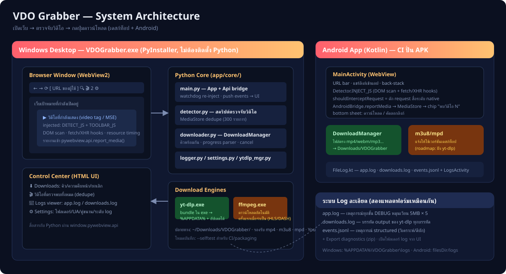
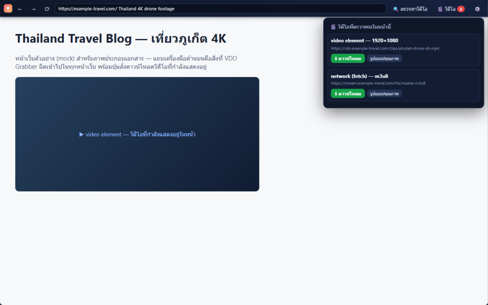
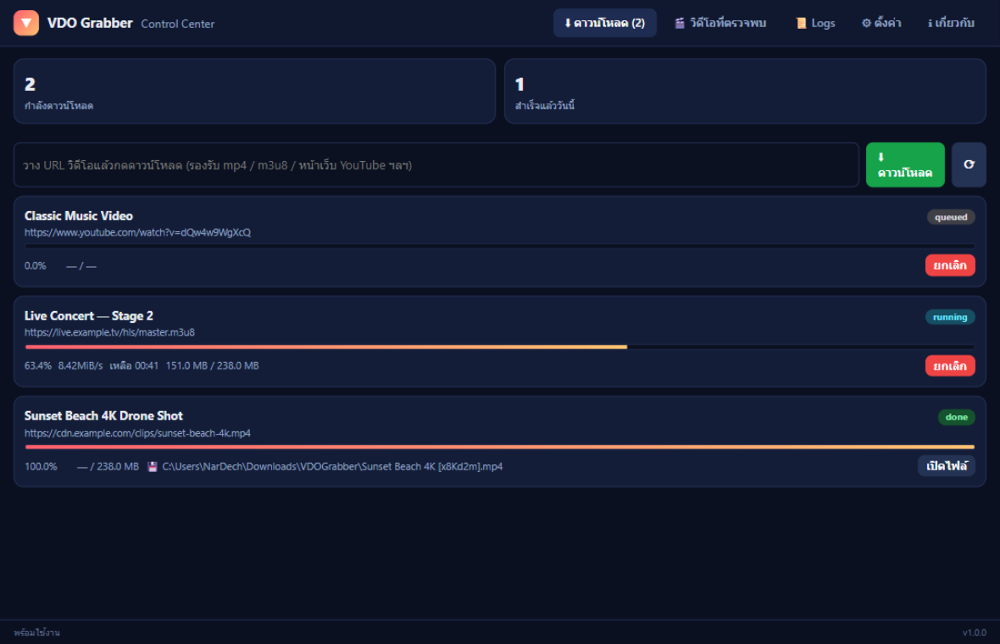
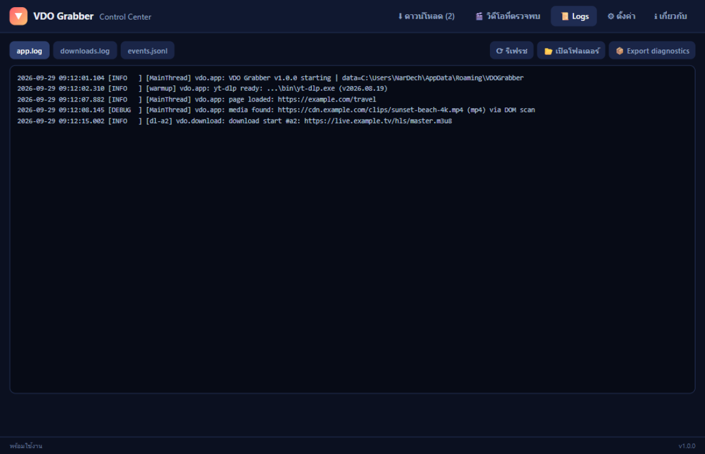
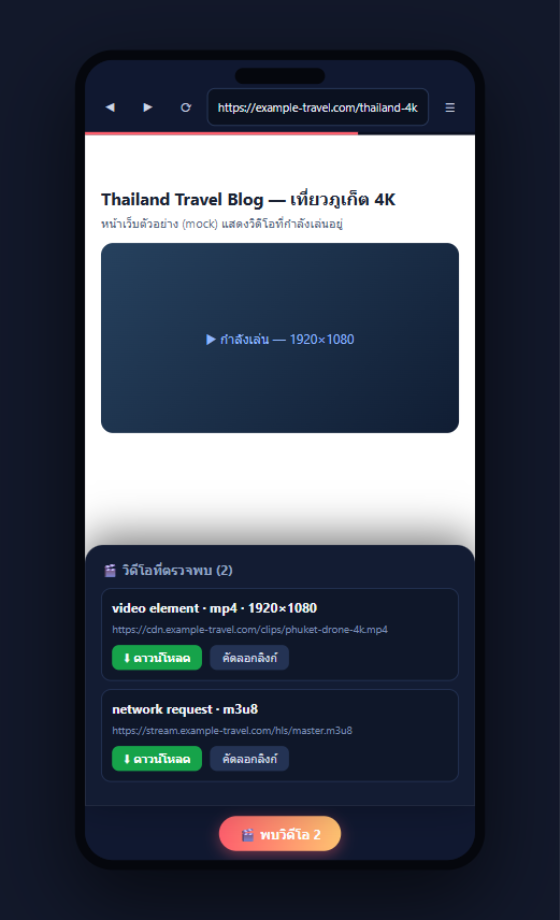

# VDO Grabber — README

**เปิดหน้าเว็บที่คุณต้องการ แล้วกดปุ่มดาวน์โหลดวิดีโอที่กำลังแสดงอยู่** — ทำงานได้ทั้งบน Windows (exe ไฟล์เดียว ไม่ต้องติดตั้ง Python) และ Android (APK)



## ความสามารถ

- 🌐 **เบราว์เซอร์ในตัว** — พิมพ์ URL ที่ต้องการ แอปจะฉีดแถบเครื่องมือของตัวเองไว้บนหน้าเว็บ
- 🎬 **ตรวจจับวิดีโออัตโนมัติ** — ใช้ 3 ชั้นเทคนิคพร้อมกัน: scan แท็ก `<video>/<source>`, hook `fetch`/`XHR`
  เพื่อจับ m3u8/mpd/mp4 ที่ไหลผ่าน network และอ่าน resource-timing (อ้างอิงเทคนิคจาก
  ส่วนขยาย Video Download Helper — ดู [RESEARCH](research.md))
- ⬇ **ปุ่มดาวน์โหลดในหน้าเว็บ** — เลือกได้ทั้ง "ดาวน์โหลดอัตโนมัติ" หรือเลือกรูปแบบ/คุณภาพ (ได้จาก yt-dlp)
- 🚀 **เอนจิน yt-dlp + ffmpeg** — รองรับ mp4, webm, HLS (m3u8), DASH (mpd) และหน้าเว็บอย่าง YouTube
- 📜 **ระบบ log ละเอียด 3 ชั้น** — `app.log` (หมุนเวียน), `downloads.log` (output ของ yt-dlp ทุกบรรทัด),
  `events.jsonl` (structured events) + ดูย้อนหลังในแอป และ Export diagnostics เป็น zip
- 🤖 **แอป Android** — WebView browser + ตรวจจับวิดีโอแบบเดียวกัน + DownloadManager

## ภาพหน้าจอ

| แถบเครื่องมือในหน้าเว็บ | Control Center |
|---|---|
|  |  |

| Logs viewer | แอป Android |
|---|---|
|  |  |

## ดาวน์โหลด / ติดตั้ง

1. ไปที่ **[หน้าดาวน์โหลด](index.html)** (GitHub Pages — ดึง release ล่าสุดอัตโนมัติ พร้อม checksum)
2. หรือจาก [GitHub Releases](https://github.com/NarDecH/VDO_Download_APK/releases/latest) ตรงๆ
   - `VDOGrabber-<เวอร์ชัน>-windows-x64.exe` — ไฟล์เดียวจบ ดับเบิลคลิกใช้ได้เลย ไม่ต้องติดตั้ง Python
   - `VDOGrabber-<เวอร์ชัน>-android.apk` — ติดตั้งจาก CI (อนุญาต "ติดตั้งจากแหล่งที่ไม่รู้จัก" ตามปกติ)
3. Windows ใช้ WebView2 Runtime (มีในตัว Windows 10/11 อยู่แล้ว) · ffmpeg จะถูกดาวน์โหลดอัตโนมัติครั้งแรกเมื่อดาวน์โหลดสตรีม HLS/DASH

## การใช้งาน

1. เปิดโปรแกรม → พิมพ์ URL ในแถบด้านบน (หรือเดินตามลิงก์ในหน้าเว็บได้ปกติ)
2. เล่นวิดีโอในหน้านั้น หรือกด **🔍 ตรวจหาวิดีโอ** — ปุ่ม 🎬 จะขึ้นจำนวนวิดีโอที่พบ
3. กด **⬇ ดาวน์โหลด** (ดีที่สุดอัตโนมัติ) หรือ **รูปแบบ/คุณภาพ** เพื่อเลือกเอง
4. ติดตามความคืบหน้าใน **⚙️ Control Center** (แท็บดาวน์โหลด/วิดีโอ/logs/ตั้งค่า)
5. ไฟล์จะอยู่ที่ `Downloads\VDOGrabber` (เปลี่ยนได้ในแท็บตั้งค่า)

## สร้างจากซอร์ส (นักพัฒนา)

```bash
# Windows Desktop
pip install -r requirements.txt
python app/main.py              # รันจากซอร์ส
python app/main.py --selftest   # ทดสอบ headless (detection + ดาวน์โหลดจริง)
python scripts/make_icon.py     # สร้างไอคอน
python scripts/build_exe.py     # แพ็ก dist/VDOGrabber.exe (PyInstaller)

# Android (หรือใช้ GitHub Actions ปั่นให้อัตโนมัติ)
cd android && ./gradlew assembleDebug
```

โครงสร้าง: `app/` (Python desktop) · `android/` (Kotlin) · `docs/` (เอกสาร + หน้าเว็บ) ·
`code/` (ซอร์สส่วนขยายต้นแบบสำหรับศึกษา — ไม่ถูก build และไม่ถูกเผยแพร่ใน repo)
รายละเอียดสำหรับ AI/ผู้ดูแล repo ดูที่ [AGENT.md](../AGENT.md)

## ข้อจำกัด

- ไม่รองรับ DRM (Widevine/Netflix ฯลฯ) และเนื้อหาบางประเภทหลังล็อกอิน
- บน Android ไฟล์ตรง (mp4/webm/mp3) ดาวน์โหลดได้เต็มรูปแบบ ส่วน HLS/DASH แนะนำให้ใช้เวอร์ชันเดสก์ท็อป
- YouTube เปลี่ยนบ่อย — ใช้ปุ่ม "อัปเดต yt-dlp" ในแท็บตั้งค่าเมื่อเจอปัญหา

## ลิขสิทธิ์

MIT — โปรดใช้ตามกฎหมายลิขสิทธิ์ของเนื้อหาที่ดาวน์โหลด
