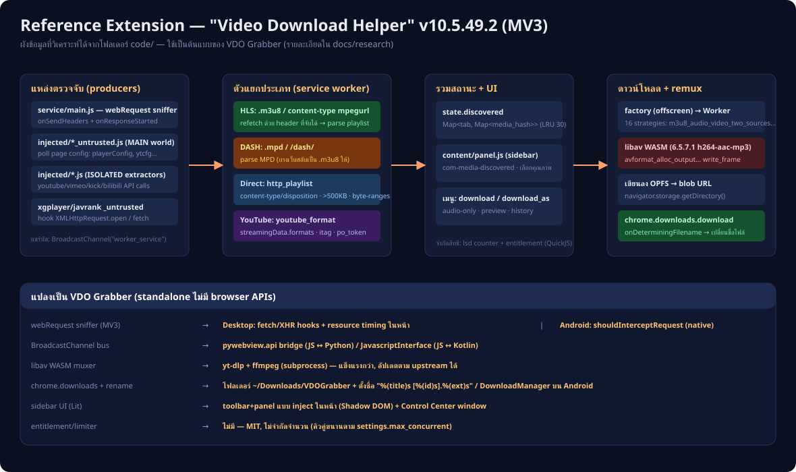

# RESEARCH — วิเคราะห์ส่วนขยาย "Video Download Helper" และการนำมาออกแบบ VDO Grabber

> ตัวต่อไปนี้วิเคราะห์จากซอร์สโค้ดจริงในโฟลเดอร์ `code/` (Chrome Extension Manifest V3, เวอร์ชัน 10.5.49.2)
> โดยมีวัตถุประสงค์เพื่อทำความเข้าใจกลไกตรวจจับ/ดาวน์โหลดวิดีโอ แล้วนำมาออกแบบเป็นแอปสแตนด์อโลน
> ทั้งบน Windows (VDOGrabber.exe) และ Android (APK)

---

## 1. สถาปัตยกรรมของส่วนขยายต้นแบบ

ส่วนขยายประกอบด้วย 5 บริบท (contexts) ที่คุยกันผ่าน **BroadcastChannel เดียวชื่อ `"worker_service"`**
โดยใช้ซองข้อความ `{msg, channel}` และ enum ช่องทาง `FromInjectedToService:0 … FromServiceToService:8`

| โฟลเดอร์ / ไฟล์ | บทบาท |
|---|---|
| `service/main.js` (554 KB) | Service Worker — สมองของระบบ: ดักจับ network, parse m3u8/MPD, เก็บสถานะ, สั่งดาวน์โหลด, จัดการ DNR rules และสิทธิการใช้งาน (มี QuickJS WASM สำหรับ license/SmartNaming) |
| `content/` | หน้า sidebar UI แบบ Lit web components (`com-main`, `com-media-discovered`, `com-media-selector` …) ประกอบด้วย panel.js, details.js, history.js, smartnaming.js, translate.js |
| `injected/` | สคริปต์เฉพาะเว็บแบบ ISOLATED world (youtube, vimeo, facebook, kick, bilibili …) คู่กับไฟล์ `*_untrusted.js` ที่รันใน MAIN world |
| `factory/factory.js` | Offscreen document ที่มีหน้าที่เดียว: spawn `Worker(download_worker/main.js)` |
| `download_worker/main.js` | Module worker ที่ bundle libav.js 6.5.7.1 + WASM (h264-aac-mp3) สำหรับ demux/remux |

## 2. กลไกการตรวจจับวิดีโอ — ดัก network ไม่ใช่แค่ scan DOM

ใน `service/main.js` ฟังก์ชัน `$f()` ลงทะเบียน `webRequest.onSendHeaders` (เก็บ header ของ request
ตาม `requestId` ใน Map, TTL 600 วินาที) และ `webRequest.onResponseStarted` → `RS()` สำหรับ
resource types `xmlhttprequest|media|main_frame|sub_frame|other` บน `<all_urls>` จากนั้น `RS()`:

- ข้าม segment `.ts/.m4s/.m2ts`; จัดการพิเศษ `player.vimeo.com/…/config` และ `intl-api.iq.com/…/dash`
- content-type ตรง `/mpegurl/i` หรือ URL ตรง `/hls|m3u8/i` → **HLS** (`zf()`): refetch playlist
  ด้วย header ที่จับได้ แล้ว broadcast `on_media` เป็น `type:"m3u8_playlist"`
- `.mpd` หรือ `/dash/i` → **MPD** (`$S()`) เป็น `type:"mpd_playlist"`
- กรณีอื่น → **direct media** (`NS()`) ดูจาก content-type/disposition, ข้ามไฟล์ < 500 KB,
  เช็ค `accept-ranges` → `type:"http_playlist"`
- โดเมนพิเศษ (youtube, instagram, vk, kick …) ถูกยกเว้นจากการ sniff และใช้ตัว extractor เฉพาะเว็บแทน

การรวมผล: `em()` เก็บใน `state.discovered: Map<tab_id, {media: Map<media_hash>}>` (LRU 30)

## 3. การฉีดสคริปต์เฉพาะเว็บ

- `*_untrusted.js` (MAIN world) ส่วนใหญ่ **poll ตัวแปร global ของหน้าเว็บ** ไม่ใช่ hook:
  vimeo ดู `window.playerConfig`, bilibili ดู `window.__initialState`, youtube ดู `ytcfg.data_.VISITOR_DATA`
- ข้อยกเว้น: `xgplayer_crypto_untrusted.js` และ `javrank_untrusted.js` **hook** `XMLHttpRequest.prototype.open` และ `window.fetch`
- สคริปต์ ISOLATED เป็นตัว extractor เต็มรูปแบบ เช่น `kick.js` POST ไป `api/v1/stream/{id}/playback`
  และสร้าง `on_media` เอง, `youtube.js` (1 MB) เป็น parser ระดับ yt-dlp (itag, signatureTimestamp, po_token)
- การสื่อสาร MAIN ↔ ISOLATED ใช้ `BroadcastChannel("injected-" + fnv64(location.href))`

## 4. ท่อดาวน์โหลด + remux

- Service `Gy()` dedupe ด้วย hash, บังคับสิทธิ (ตัวนับ `lsd`, หน้าต่าง 7200 วิ), จัดคิวผ่าน limiter
- Worker มี 16 strategy เช่น `m3u8_audio_video_two_sources`, `mpd_video_preview`, `http_strip_audio_jsfetch`, `youtube_audio_only`
- เขียนไฟล์ผ่าน libav (`avformat_alloc_output_context2`, `write_header`, `av_interleaved_write_frame`,
  `write_trailer`) ลง **OPFS** แล้วสร้าง `URL.createObjectURL(file)` คืนเป็น `download_result`
- Service เรียก `chrome.downloads.download` และเปลี่ยนชื่อไฟล์ด้วย `downloads.onDeterminingFilename` (conflictAction: uniquify)

## 5. UI flow

`panel.js` mirror สถานะจาก service ทุกการ์ด `com-media` มีตัวเลือก variant (`media_selector`)
แสดงป้ายคุณภาพ (`quality_highest` …) ปุ่ม preview และปุ่มสั่ง `do_download` ที่แนบ
`{download_args, meta, media}` — รองรับ download / download_as / audio-only

## 6. แนวคิดที่นำมาใช้ใน VDO Grabber (และสิ่งที่เปลี่ยน)

| เทคนิคของ extension | ใน VDO Grabber (ไม่มี browser APIs) |
|---|---|
| webRequest sniffer | **Desktop:** hook `fetch`/`XHR` + performance resource-timing ในหน้า · **Android:** `shouldInterceptRequest` (native sniff) |
| BroadcastChannel bus | pywebview `js_api` bridge (JS↔Python) / `JavascriptInterface` (JS↔Kotlin) |
| libav WASM muxer | **yt-dlp + ffmpeg** แบบ subprocess — แข็งแรงกว่าและอัปเดตตาม upstream ได้ (`-U`) |
| chrome.downloads + rename | เขียนลง `~/Downloads/VDOGrabber` ตั้งชื่อ `%(title)s [%(id)s].%(ext)s` / DownloadManager บน Android |
| Sidebar UI (Lit) | Toolbar+panel แบบ inject ในหน้า (Shadow DOM) + หน้าต่าง Control Center |
| entitlement/ตัวจำกัด | ไม่มี — โอเพนซอร์ส MIT, จำกัดแค่จำนวนดาวน์โหลดคู่ขนานตาม settings |

ข้อจำกัดที่ทราบและยอมรับไว้: ไม่มีการทำงานกับ DRM (Widevine), เนื้อหาหลังล็อกอินบางประเภท
(ไม่มี cookie profile ของเบราว์เซอร์ผู้ใช้), และ YouTube บางช่วงอาจต้องรอ yt-dlp อัปเดต

## 7. สถาปัตยกรรมการดาวน์โหลดและหน้าสื่อบน Android (v1.5.0–v1.6.0)

### ท่อดาวน์โหลด

- **การ route URL** — `Downloader.routeOf()` แบ่ง 3 ทาง: `DIRECT_FILE` (นามสกุลสื่อ →
  DownloadManager, ตรวจไฟล์ HTML ปลอมหลังเสร็จแล้ว re-route อัตโนมัติ), `STREAM`
  (m3u8/mpd) และ `PAGE` (หน้าเล่น/หน้า embed) → ทั้งสองทางหลังเข้า `StreamDownloadService`
  ที่รัน yt-dlp บนเครื่อง
- **StreamDownloadService** — foreground service ที่รับงานได้ซ้อนกัน: แต่ละ `onStartCommand`
  สร้าง coroutine + pid ของตัวเอง, เขียนลงโฟลเดอร์ engine-work (app-private, กัน scoped storage)
  แล้ว `publishFile()` ย้ายไฟล์เสร็จเข้า `Downloads/VDOGrabber` ผ่าน MediaStore API
- **DownloadJobs (registry)** — ฐานสถานะกลางของงานที่กำลังวิ่ง: `(pid, url, title, percent)`
  ต่องาน ใช้ร่วมกันระหว่าง chip ticker (แสดง percent สูงสุด) และแท็บ "กำลังดาวน์โหลด"
  (รายการเรียงเก่า→ใหม่) · คู่ `markCancelled`/`consumeCancelled` แยก "ผู้ใช้ยกเลิก"
  ออกจาก "งานล้มเหลว" ใน log และการแจ้งเตือน
- **การยกเลิก** — `ACTION_CANCEL` พร้อม `EXTRA_PID` ยกเลิกเฉพาะงานนั้น
  (`destroyProcessById`); แถบแจ้งเตือนไม่ส่ง pid = ยกเลิกทั้งหมด · `stopSelfResult(startId)`
  ทำให้ service จบเมื่องานสุดท้ายเท่านั้น (งานใหม่ที่เข้ามาระหว่างวิ่งไม่ถูกฆ่าตาม)

### หน้าสื่อ (media sheet) 3 แท็บ

| แท็บ | แหล่งข้อมูล | ปุ่ม |
|---|---|---|
| พบวิดีโอ | `MediaStore` (LRU, รีเซ็ตเมื่อ origin เปลี่ยน) | ดาวน์โหลด / คัดลอกลิงก์ / เปิด embed |
| กำลังดาวน์โหลด | `DownloadJobs.active()` | ยกเลิกรายงาน |
| ดาวน์โหลดเสร็จแล้ว | `DownloadCleaner.systemList()` | ลบรายไฟล์ / ล้างทั้งหมด (v1.6.0) |

- แท็บที่เปิดเมื่อมีงานวิ่งคือ "กำลังดาวน์โหลด" โดยอัตโนมัติ · แถว percent/แถบคืบหน้า
  **วาด in-place** จาก ticker หลักทุก 500 ms (สร้าง view ใหม่เมื่อชุด pid เปลี่ยนเท่านั้น —
  กดปุ่มไม่หลุด)
- **แจ้งเตือนในแอป (v1.6.0)** — service broadcast `DL_STATE` (ok/percent) ตอนงานจบ,
  MainActivity ฟังแล้วโชว์ Snackbar + ชิปสถานะชั่วคราว (~8 วิ) ข้อความเดียวกัน และ
  ฟื้นแท็บพบวิดีโอ/ชิปตามสถานะ
- **ล้างทั้งหมด (v1.6.0)** — `DownloadCleaner.deleteAll()` ลบทุก Candidate ต่อ identity
  (MediaStore → DM → ไฟล์จริง) นับสำเร็จรายไฟล์, log event `download_cleared_all`,
  มี dialog ยืนยัน — logic บริสุทธิ์และเทส JVM ได้ (DownloadCleanerTest)

---

*วิเคราะห์เชิงโครงสร้างจากซอร์สที่ถูก minify โดยค้นหาสตริง/ชื่อฟังก์ชันอ้างอิง เช่น `$f()`, `RS()`, `zf()`,
`state.discovered`, `on_media`, `do_download`, `download_id`, `muxer`, `strategy`, `OPFS` —
ทั้งหมดชี้ตำแหน่งได้ในไฟล์ภายใต้ `code/`*
